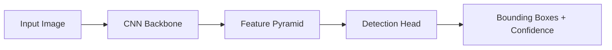

# vision-forge

[](https://python.org)
[](https://github.com/ultralytics/ultralytics)
[](https://opencv.org)
[](https://gradio.app)
[](LICENSE)

---

## Table of Contents

- [Overview](#overview)
- [Features](#features)
- [Architecture](#architecture)
- [Getting Started](#getting-started)
  - [Prerequisites](#1-prerequisites)
  - [Clone](#2-clone-the-repository)
  - [Setup](#3-setup-virtual-environment)
  - [Dependencies](#4-install-dependencies)
  - [Dataset](#5-dataset-setup)
- [Usage](#usage)
  - [Training](#training)
  - [Inference](#inference)
  - [Demo](#demo)
- [Results](#results)
- [Project Structure](#project-structure)
- [Contributing](#contributing)
- [License](#license)
- [Author](#author)

---

## Overview

**Vision-Forge** is a deep learning-based computer vision system designed to detect potholes in road imagery with high accuracy. Leveraging the YOLOv8 object detection architecture, it enables automated road condition assessment for infrastructure monitoring, civic maintenance, and smart-city applications.

The system supports end-to-end workflows — from data preparation and model training to inference and interactive testing via a Gradio web interface.

---

## Features

- **YOLOv8-based Detection** — State-of-the-art CNN for real-time object detection
- **Transfer Learning** — Pretrained backbone for faster convergence on limited data
- **Image Inference** — Batch and single-image detection pipelines
- **Interactive UI** — Gradio-powered web interface for instant testing
- **Bounding Box Output** — Visualized predictions with confidence scores
- **Modular Codebase** — Clean separation of training, inference, augmentation, and evaluation

---

## Architecture

Vision-Forge uses a **Convolutional Neural Network (CNN)** backbone via YOLOv8 ([Ultralytics](https://github.com/ultralytics/ultralytics)). The model ingests road images, extracts hierarchical spatial features, and outputs bounding box coordinates with class probabilities for pothole instances.



---

## Getting Started

### 1. Prerequisites

- Python 3.8+
- Git
- pip

### 2. Clone the Repository

```bash
git clone https://github.com/udii05/Pothole-Detector-CV.git
cd Pothole-Detector-CV
```

### 3. Setup Virtual Environment

```bash
python -m venv venv
```

**Windows**
```bash
venv\Scripts\activate
```

**macOS / Linux**
```bash
source venv/bin/activate
```

### 4. Install Dependencies

```bash
pip install -r requirements.txt
```

### 5. Dataset Setup

Download or prepare a dataset in YOLOv8 format and organize as follows:

```
data/
├── train/
├── valid/
├── test/
└── data.yaml
```

---

## Usage

### Training

```bash
python src/train.py
```

Trains the YOLOv8 model on the pothole dataset. Checkpoints and logs are saved to `runs/detect/pothole_detector/`.

### Inference

```bash
python src/inference.py
```

Runs detection on a sample image and outputs predictions with bounding boxes overlaid.

### Demo

```bash
python src/demo.py
```

Launches a Gradio web interface locally. Upload an image to detect potholes in real time.

---

## Results

Performance is evaluated using standard object detection metrics:

- **Precision** — Ratio of true positive detections to all positive predictions
- **Recall** — Ratio of true positive detections to all ground-truth objects
- **mAP** — Mean Average Precision across IoU thresholds

Outputs, plots, and logs are stored under:

```
results/
```

---

## Project Structure

```
Pothole-Detector-CV/
├── data/                  # Dataset (train / valid / test)
│   ├── train/
│   ├── valid/
│   ├── test/
│   └── data.yaml
├── notebooks/            # Jupyter notebooks
│   ├── 01_data_exploration.ipynb
│   ├── 02_training.ipynb
│   └── 03_evaluation.ipynb
├── src/                  # Source code
│   ├── train.py          # Training script
│   ├── inference.py      # Inference script
│   ├── demo.py           # Gradio UI
│   └── augment.py        # Data augmentation
├── results/              # Evaluation outputs
├── requirements.txt      # Python dependencies
├── README.md             # Project documentation
└── .gitignore
```

---

## Contributing

Contributions are welcome. To contribute:

1. Fork the repository
2. Create a feature branch (`git checkout -b feature/amazing-feature`)
3. Commit your changes (`git commit -m 'Add amazing feature'`)
4. Push to the branch (`git push origin feature/amazing-feature`)
5. Open a Pull Request

---

## License

This project is licensed under the MIT License. See the [LICENSE](LICENSE) file for details.

---

## Author

**Udita Chakraborty**

<p align="left">
  <a href="https://github.com/udii05">
    
  </a>
  <a href="https://www.linkedin.com/in/udita-chakraborty-b890982a2/">
    
  </a>
</p>
